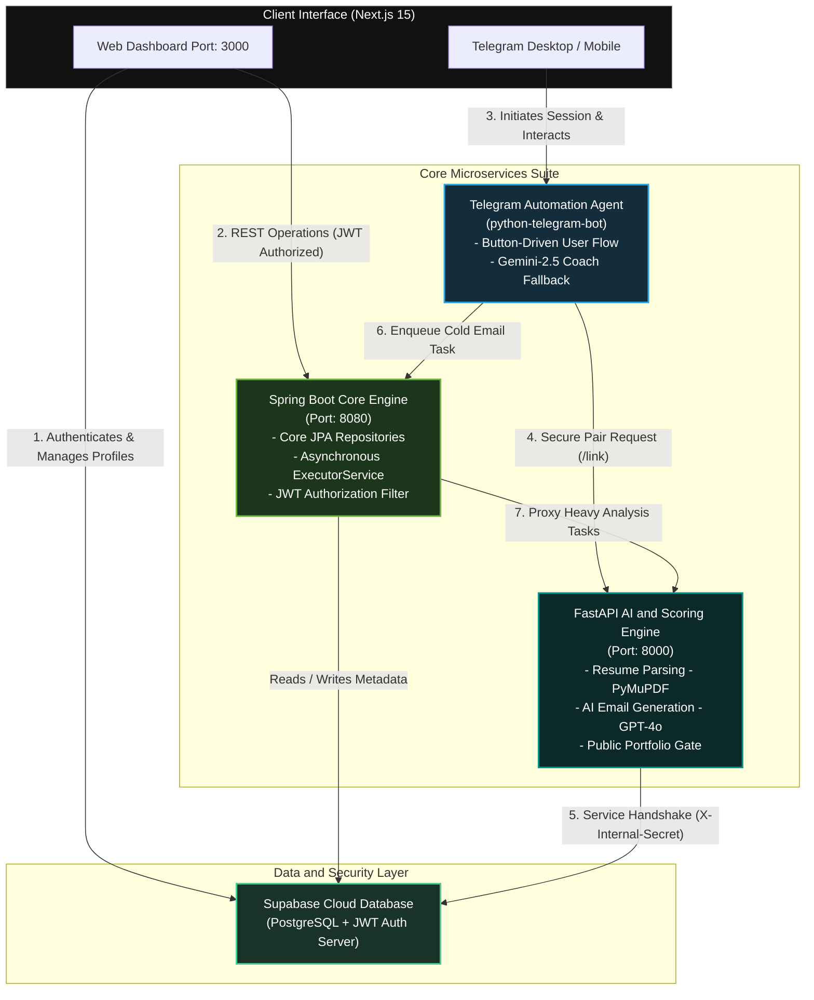

<p align="center">
  
</p>

<div align="center">
  <h1>🪐 Cypherdon</h1>
  <p><b>An Enterprise-Grade Polyglot Platform for Asynchronous Job Application & AI-Driven Email Automation</b></p>
  <br />

  <a href="https://openjdk.org/">
    
  </a>
  <a href="https://spring.io/projects/spring-boot">
    
  </a>
  <a href="https://python.org">
    
  </a>
  <a href="https://fastapi.tiangolo.com/">
    
  </a>
  <a href="https://nextjs.org/">
    
  </a>
  <a href="https://supabase.com/">
    
  </a>
  <a href="https://core.telegram.org/bots">
    
  </a>
</div>

---

## 🏛️ Architectural Topology

Cypherdon is built on a **polyglot microservices architecture** designed for high throughput, robust async execution, and strict cross-service security boundaries.

### System Flowchart

The following diagram illustrates the complete asynchronous telemetry, user authentication, and internal handshake patterns across the platform:



### Microservice Network Layout

```
                        +----------------------------+
                        |     Next.js Web Client     |
                        |        (Port 3000)         |
                        +--------------+-------------+
                                       | (REST / JWT)
                                       v
                        +----------------------------+
                        |  Spring Boot Core Gateway  | <----+
                        |        (Port 8080)         |      | (Async Queue API)
                        +--------------+-------------+      |
                                       |                    |
             (JDBC Connection)         | (Internal REST)    |
                    +------------------+                    |
                    |                  v                    |
                    v   +----------------------------+      |
        +---------------+--+   FastAPI AI Engine     +------+---+
        |    Supabase DB   |   |     (Port 8000)      |  Telegram Bot   |
        |   (PostgreSQL)   |   +----------+-----------+  | (python-tg)   |
        +------------------+              ^             +-------+-------+
                                          |                     |
                                          +---------------------+
                                            (X-Internal-Secret Handshake)
```

---

## ⚡ Technical Core Features

### 📭 High-Throughput Asynchronous Mail Pipeline
To protect developer domains from blacklisting and prevent spam filters from catching cold emails, Cypherdon integrates a resilient, rate-limited worker engine inside the Spring Boot Core:
* **Concurreny Engine**: Managed via a dedicated `ExecutorService` thread pool.
* **Randomized Jitter Delay**: Executes a randomized 10–20 minute send delay between individual emails to simulate authentic manual behavior.
* **Dynamic Backoff**: Requeues failed sends using a progressive retry timeline (5 mins → 15 mins → 45 mins) to handle server-side rate limits or SMTP network hiccups.
* **Gated Tiering**: Automatically enforces daily limits:
  * **Free Account**: Limit of 3 cold-emails queued and executed per 24-hour cycle.
  * **Premium Account**: Multiplies capacity to 15 queued sends per day.

### 🛡️ Double-Auth Gated Security Boundaries
The application is structured under strict, isolated security tiers preventing unauthorized inter-service communication:
1. **User Auth Boundary**: All user endpoints require a valid Bearer JWT issued and authenticated by **Supabase Auth**.
2. **Service Auth Boundary**: All service-to-service API calls (e.g. Telegram Bot to FastAPI, Spring Boot proxy handshakes) are gated by a custom middleware filter that inspects and validates the `X-Internal-Secret` header token. This locks down internal operations from the public internet.

### 🌟 Premium White-Labeled Developer Portfolios
Premium members unlock recruiter-facing public portfolio sharing links.
* **Locked-by-Default Core**: The `/api/profile/public/{user_id}` route conducts an internal subscription state check.
* **Enforced Gating**: Free tier profiles requesting a portfolio review are rejected with a structured `403 Forbidden` response. Premium tier users' portfolios bypass authorization headers to serve beautifully rendered public developer bios directly to hiring managers.

### 🤖 Web Console Pairing & Telegram Bot Co-Pilot
The bot acts as a fully command-free companion for resume tracking, scoring, and AI mail generation:
* **Pairing Handshake**: Users copy their unique, one-time pairing key `/link email@domain.com` directly from the glassmorphic **Telegram Agent Integration Card** inside the web Console Settings tab (`/profile` page).
* **Gemini AI Career Mentor Fallback**: Built directly on `google-generativeai` (`gemini-2.5-flash`), the companion bot acts as a responsive interview coach when conversed with outside the automated cold mail lifecycle.

---

## 📂 System Directory Topology

```
cypherdon/
├── frontend/                # Next.js 15 Web Application Dashboard
│   ├── app/                 # Page router components (dashboard, billing, settings)
│   │   ├── complete-profile/# Developer onboard walkthrough page
│   │   ├── portfolio/       # Publicly viewable white-labeled portfolio
│   │   └── profile/         # Profile Settings containing the Telegram Integration Card
│   ├── components/          # Shared components (ParticleSphere, AvatarDropdown, Footer)
│   └── lib/                 # Core browser SDKs and storage wrappers
│
├── backend/                 # Python FastAPI (AI & Contextual Parsing Engine)
│   ├── bot/                 # Telegram Bot orchestrator & Gemini Career Coach
│   ├── routers/             # API Endpoints (Resume scoring, AI generation, Public profile gates)
│   ├── services/            # Deep-analysis algorithms (PyMuPDF parser, ATS scoring)
│   ├── tests/               # Automated test coverage suite (pytest)
│   └── requirements.txt
│
└── spring-backend/          # Enterprise Core Gateway & Asynchronous Worker (Java 21)
    └── src/main/java/com/cypherdon/core/
        ├── config/          # JWT WebSecurity config & InternalApiKeyFilters
        ├── controller/      # REST API Controllers (Signup, JWT-gateway proxies)
        ├── repository/      # Spring Data JPA database connectors
        └── scheduler/       # EmailWorker (Async ExecutorService email dispatcher)
```

---

## 📡 API Directory

### FastAPI Service (Port 8000)

| Endpoint | Verb | Authorization | Function |
|:---|:---:|:---:|:---|
| `/health` | `GET` | Public | Core platform health check |
| `/api/resume/analyze` | `POST` | JWT Bearer | Process PDF upload & target role for ATS score |
| `/api/emails/generate` | `POST` | JWT Bearer | Compile targeted cold emails via GPT-4o-mini |
| `/api/match-jobs` | `POST` | JWT Bearer | Returns Skill, Role, and Experience match matrix |
| `/api/profile/` | `GET` | JWT Bearer | Fetch the authenticated user's complete profile |
| `/api/profile/` | `PUT` | JWT Bearer | Update specific fields in developer profile |
| `/api/profile/public/{user_id}` | `GET` | Public | Public white-labeled portfolio data (Gated to Premium) |
| `/api/profile/internal/by-email/{email}` | `GET` | Service Token | Handshake API for Telegram Bot user validation |

### Spring Boot Core Engine (Port 8080)

| Endpoint | Verb | Authorization | Function |
|:---|:---:|:---:|:---|
| `/api/auth/signup` | `POST` | Public | Create new platform credentials |
| `/api/auth/login` | `POST` | Public | Validate credentials & generate session tokens |
| `/api/jobs` | `GET` | JWT Bearer | Returns user-specific scraped target job listings |
| `/api/applications` | `POST` | JWT Bearer | Registers a job application record |
| `/api/emails/queue` | `POST` | Service Token | Enqueue processed drafts for asynchronous randomized delivery |

---

## 🧪 Automated Testing Suite

Cypherdon features an automated, mock-driven backend validation suite built on `pytest` to ensure secure routing boundaries, profile updates, and subscription gates.

### Test Coverage Breakdown
The test harness located in [backend/tests/test_profile.py](file:///c:/Users/hwbha/c++%20code/cypherdon/backend/tests/test_profile.py) verifies the following critical paths:
1. **Platform Integrity (`test_health_check`)**: Assures the base index endpoint returns healthy status telemetry.
2. **Access Control Gates (`test_unauthorized_profile_access`)**: Asserts that unauthorized API requests to secure profile routes fail securely with a `403 Forbidden` status.
3. **Dependency Injection Overrides (`test_authorized_profile_access`)**: Bypasses external cloud token dependencies using mock overrides to test clean schema extraction on profile fetch.
4. **Premium Portfolio Gating**:
   * `test_public_profile_free_user`: Assures public requests to free profiles return `403` with a explicit notice to upgrade subscription.
   * `test_public_profile_premium_user`: Assures public requests to premium profiles succeed with a `200 OK` return.

### Running Backend Tests
To run the automated Python test suite:

1. Enter the backend context:
   ```bash
   cd backend
   ```
2. Execute the tests in verbose mode:
   ```bash
   pytest -v
   ```

---

## 🛠️ Step-by-Step Local Deployment

### 1. Prerequisites
Install these platform runtimes on your local workstation:
* **Java**: OpenJDK 21+
* **Python**: Python 3.10+ (ensure `pip` is updated)
* **Node.js**: Node 18+ (bundled with `npm`)
* Set up a **Supabase Project** and generate an API key and Database URI.
* Acquire a **Gmail SMTP App Password** for sending emails.
* Retrieve a bot token from Telegram's **@BotFather**.

### 2. Configure Environment Variables
Create a unified `.env` file under the `/backend` directory:
```env
TELEGRAM_BOT_TOKEN="your_telegram_bot_token"
FASTAPI_URL="http://localhost:8000"
SPRING_BOOT_URL="http://localhost:8080"
INTERNAL_SERVICE_KEY="your_secure_internal_handshake_secret"
SUPABASE_URL="your_supabase_project_url"
SUPABASE_KEY="your_supabase_anon_public_key"
GEMINI_API_KEY="your_gemini_api_key_for_career_coach"
OPENAI_API_KEY="your_openai_api_key_for_resume_scoring"
```

Configure your datasource parameters and App Passwords inside `spring-backend/src/main/resources/application.yml`.

### 3. Initialize the AI & Automation Backend
```bash
cd backend
pip install -r requirements.txt
python main.py
```
*Engine active and listening at `http://localhost:8000`*

### 4. Boot the Core Gateway Server
```bash
cd spring-backend
./mvnw spring-boot:run
```
*Core active and listening at `http://localhost:8080`*

### 5. Launch the Client Portal
```bash
cd frontend
npm install
npm run dev
```
*Client active and running at `http://localhost:3000`*

### 6. Spin Up the Telegram Companion Bot
```bash
cd backend
python -m bot.main
```
*Bot active and polling Telegram servers for incoming web-pairs!*

---

## 🤝 Contribution Guidelines

1. **Fork** this codebase to your own namespace.
2. Form a new workspace branch: `git checkout -b feature/amazing-optimization`
3. Commit code following strict conventional commit guidelines.
4. Verify changes against the automated testing suite (`pytest -v`).
5. Open a **Pull Request** detailing system optimizations and benchmark differences.

---

<div align="center">
  <b>Architected and Crafted by <a href="https://github.com/HarshwardhanBhaskar">Harsh Wardhan Bhaskar</a></b>
</div>
